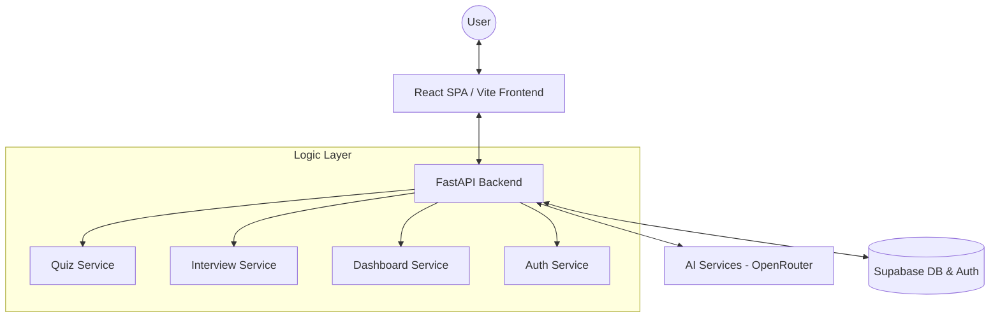

# Mentra AI: Intelligent Student Support & Interview System

**Mentra AI** is a premium SaaS-like platform designed to revolutionize the way students learn and prepare for technical careers. Using advanced Large Language Models (LLMs), Mentra AI provides personalized learning paths through adaptive quizzes and high-fidelity technical interview simulations.

---

## 🚀 Key Features

### 1. **Personalized AI Tutor (Quiz mode)**
- **Adaptive Questioning:** Generates quizzes based on specific subjects, topics, and difficulty levels.
- **Dynamic Question Types:** Supports a mix of Multiple Choice, True/False, Fill-in-the-Blanks, and Open-ended subjective questions.
- **Contextual Feedback:** Not only grades answers but provides deep explanations for "Why" an answer is correct or incorrect.

### 2. **Professional Interview Simulator**
- **Role-Specificity:** Tailored logic for roles like Senior Frontend Engineer, ML Engineer, Data Scientist, and more.
- **Dynamic Interaction:** Simulate real-world pressure with time-series based questioning and customizable session lengths.
- **Feedback Loop:** Get a comprehensive summary of strengths and weaknesses after every session.

### 3. **Performance Analytics Dashboard**
- **Progress Tracking:** Interactive charts visualizing score trends over time, decoupled to show Interview and Quiz histories separately.
- **Subject & Role Mastery:** Granular bar charts showing performance across different domains and target roles.
- **Data Persistence:** All attempts are stored and tracked using a secure cloud database.

### 4. **Premium User Experience**
- **Auth-First Security:** Secure login/signup system powered by Supabase and context-based routing.
- **Modern UI:** A stunning, glassmorphic dark-theme application built with React, Tailwind CSS, and Framer Motion.
- **Fast & Responsive:** Decoupled architecture using FastAPI for the core logic layer and Vite for lightning-fast frontend delivery.

---

## 🛠️ Technology Stack

| Layer | Technology |
| :--- | :--- |
| **Frontend** | React, Vite, Tailwind CSS v4, Framer Motion, Recharts |
| **Backend** | Python, FastAPI, Uvicorn |
| **Artificial Intelligence** | DeepSeek/OpenAI (via OpenRouter AI) |
| **Database & Auth** | Supabase (PostgreSQL) |
| **Environment** | Node.js, Python 3.9+, Dotenv |

---

## 🏗️ System Architecture



---

## ⚙️ Setup & Installation

1. **Clone the Repository:**
   ```bash
   git clone <repository-url>
   cd "AI Tutor and Student Support System"
   ```

2. **Set up Environment Variables:**
   Create a `.env` file in the root `backend/` directory:
   ```env
   OPENAI_API_KEY=your_key_here
   SUPABASE_URL=your_supabase_url
   SUPABASE_KEY=your_supabase_anon_key
   ```
   Create a `.env` file in the `web-frontend/` directory (for connecting to the backend):
   ```env
   VITE_API_URL=http://127.0.0.1:8000
   ```

3. **Install Backend Dependencies:**
   ```bash
   pip install -r requirements.txt
   ```

4. **Install Frontend Dependencies:**
   ```bash
   cd web-frontend
   npm install
   ```

5. **Run the Application:**
   - **Start Backend:** Open a terminal in the root folder and run:
     `python -m uvicorn backend.main:app --reload`
   - **Start Frontend:** Open a terminal in the `web-frontend` folder and run:
     `npm run dev`

---

## 👨‍💻 Developer Note
Created as part of an advanced exploration in AI-Integrated Software Engineering. Mentra AI demonstrates the synergy between modern cloud services, React-driven UI, and agentic AI to solve real-world educational challenges.